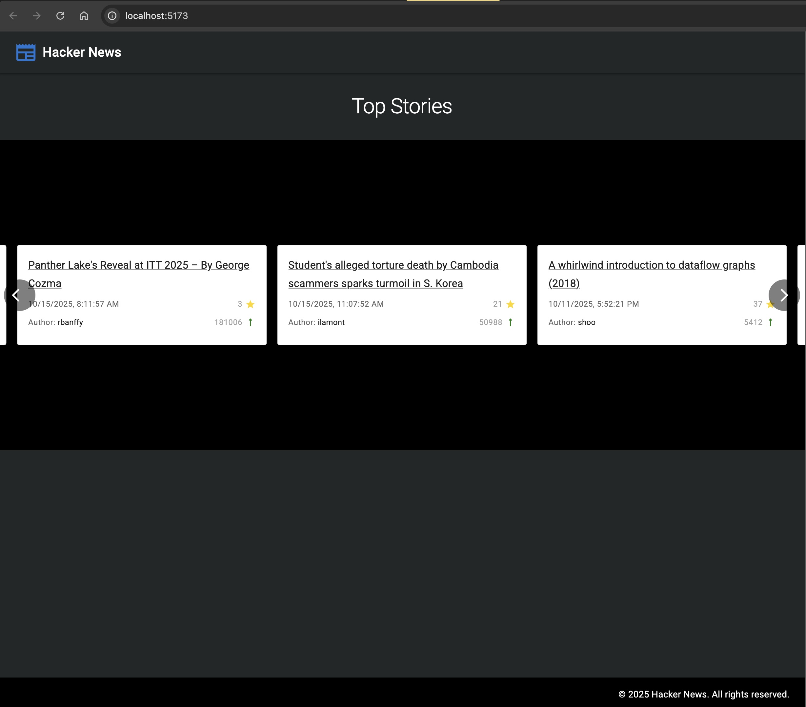

# 📰 Hacker News Reader

A modern, responsive Hacker News reader built with React, TypeScript, and Material-UI. Experience the latest tech stories in a beautiful carousel interface! 

**Author:** Leonardo Lima (@zeonardo)

🌟 **[Live Demo](https://zeonardo.github.io/hacker-news/){:target="_blank"}**



## ✨ Features

- 📱 **Responsive Design** - Works seamlessly on desktop, tablet, and mobile
- 🎠 **Interactive Carousel** - Browse stories with smooth navigation
- ⚡ **Real-time Data** - Fetches latest stories from Hacker News API
- 🎨 **Material Design** - Clean, modern UI with Material-UI components
- 🧪 **Well Tested** - Comprehensive test suite with Jest and React Testing Library

## 🚀 Getting Started

### Prerequisites
- Node.js 18+ 
- Yarn package manager

### Local Development

1. **Clone the repository**
   ```bash
   git clone https://github.com/zeonardo/hacker-news.git
   cd hacker-news
   ```

2. **Install dependencies**
   ```bash
   yarn install
   ```

3. **Start the development server**
   ```bash
   yarn dev
   ```

4. **Open your browser** to `http://localhost:5173` 🎉

### Other Commands

```bash
yarn build          # 🏗️  Build for production
yarn test           # 🧪 Run tests in watch mode
yarn test:ci        # ⚙️  Run tests once (CI mode)
yarn lint           # 🔍 Check code quality
yarn deploy         # 🚀 Deploy to GitHub Pages
```

## 🛠️ Key Technologies

### **React + TypeScript**
Modern React with full TypeScript support for type-safe development and better developer experience.

### **Material-UI (@mui/material)**
Google's Material Design system providing beautiful, accessible components and consistent theming.

### **Vite**
Lightning-fast build tool with HMR (Hot Module Replacement) for instant development feedback.

### **React Alice Carousel**
Smooth, lightweight, responsive carousel component for browsing stories with touch/swipe support.

### **Axios**
Promise-based HTTP client for reliable API communication with the Hacker News API.

### **Jest + React Testing Library**
Comprehensive testing setup following best practices for component and hook testing.

### **Husky + ESLint + Prettier**
Code quality tools with pre-commit hooks ensuring consistent, clean code.

## 📖 Project Structure

```
src/
├── components/     # Reusable UI components
├── hooks/         # Custom React hooks
├── services/      # API services and business logic
├── types/         # TypeScript type definitions
├── utils/         # Helper functions
└── styles/        # Custom styles and themes
```

## 🤝 Contributing

1. Fork the repository
2. Create a feature branch
3. Make your changes
4. Run tests: `yarn test:ci`
5. Submit a pull request

---

Built with ❤️ by [Leonardo Lima](https://github.com/zeonardo)
